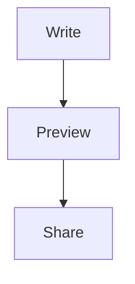

# Markor

[](https://github.com/gsantner/markor/releases)
[](https://f-droid.org/packages/net.gsantner.markor/)
[](https://crowdin.com/project/markor)
[](https://github.com/gsantner/markor/actions/workflows/build-android-project.yml)

Markor is a lightweight, offline-first text editor for Android. Use it for notes, to-do lists, plain text files, and documents written in common markup formats.

Files remain ordinary text files, so they can be edited, searched, synchronized, or processed with other tools on any platform.

## Features

- Markdown editor with syntax highlighting, HTML/PDF preview, tables, tasks, math, YAML front matter, and optional Mermaid diagrams.
- todo.txt editor with task actions, projects, contexts, priorities, and search.
- Zim/WikiText, AsciiDoc, Org-Mode, CSV, and plaintext support.
- Notebook file browser, QuickNote, To-Do, templates, bookmarks, and file actions.
- Automatic saving with undo/redo, configurable themes, fonts, line numbers, and language selection.
- Completely offline operation with no ads or unnecessary permissions.
- Optional AES-256 encryption for text files.

## What's new

The current unreleased changes include:

- Pad mode keeps the notebook file list visible beside the open document.
- Markdown view mode can render Mermaid diagrams when enabled in Settings > Format > Markdown > View mode.
- Markdown preview handles headings immediately following empty HTML paragraphs correctly.
- Markdown preview supports an absolute or relative image folder; root-relative image paths use that folder.

## Markdown Mermaid diagrams

Enable Mermaid in **Settings > Format > Markdown > View mode**, then use either a fenced code block:



or an HTML Mermaid block:

```html
<div align="center">
<pre class="mermaid">
graph TD
    A[Write] --> B[Preview]
</pre>
</div>
```

Mermaid rendering is disabled by default.

## Download

- [F-Droid](https://f-droid.org/packages/net.gsantner.markor/)
- [GitHub releases](https://github.com/gsantner/markor/releases/latest)

## Documentation

- [Documentation index](doc/README.md)
- [Keyboard shortcuts](doc/keyboard-shortcuts.md)
- [CSV format notes](doc/2023-06-02-csv-readme.md)
- [News and release notes](NEWS.md)
- [Contributors](CONTRIBUTORS.md)

## Development

Markor uses Java, Android SDK, AndroidX, Gradle, and a Makefile. It does not use the NDK and produces one APK for all supported architectures.

Open the project in Android Studio, or use the Makefile from a configured Android SDK environment:

```sh
make test
make lint
make all
```

Build artifacts, logs, lint results, and test results are written to `dist/`.

The project follows the [AOSP Java Code Style](https://source.android.com/source/code-style). See [doc/maintain.md](doc/maintain.md) for maintenance and release-note conventions.

## Privacy

Markor works offline and does not send personal data to the author or third parties. Network access is only used when user-authored content references an external resource, such as an image URL.

Files are stored locally in a folder selected by the user. Synchronization is handled by the user's chosen file-sync application.

## Contributing

Bug reports, feature requests, translations, and code contributions are welcome. Please search existing [issues](https://github.com/gsantner/markor/issues) and [discussions](https://github.com/gsantner/markor/discussions) before opening a new one.

## License

Application code is licensed under [Apache License 2.0](LICENSE.txt). Samples and localization files are licensed under [CC0 1.0](https://creativecommons.org/publicdomain/zero/1.0/).

See [README.old.md](README.old.md) for the previous README version.
